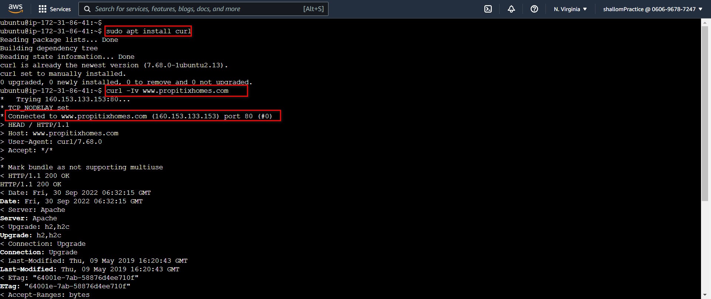
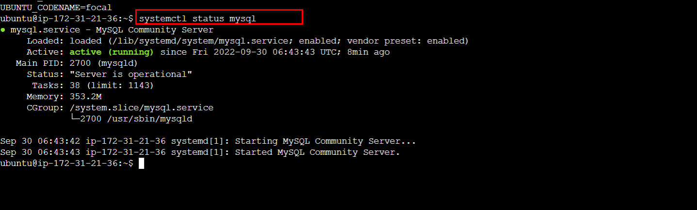
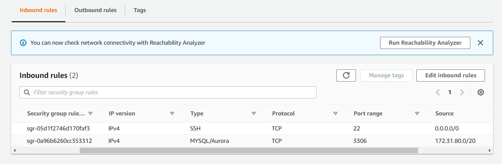
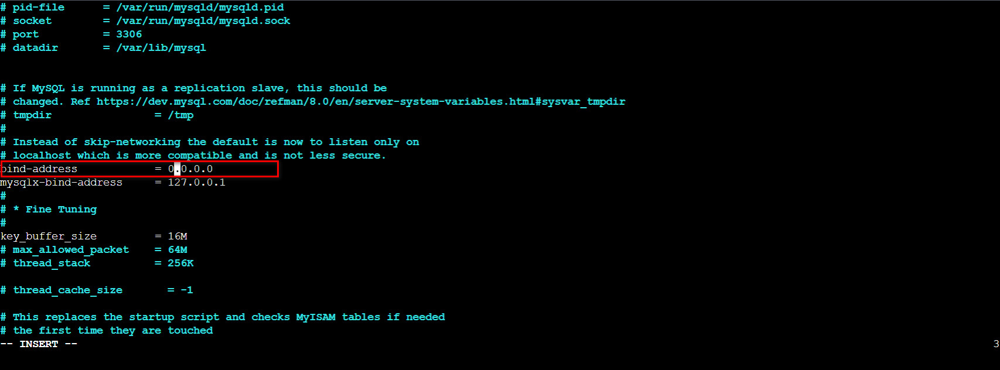
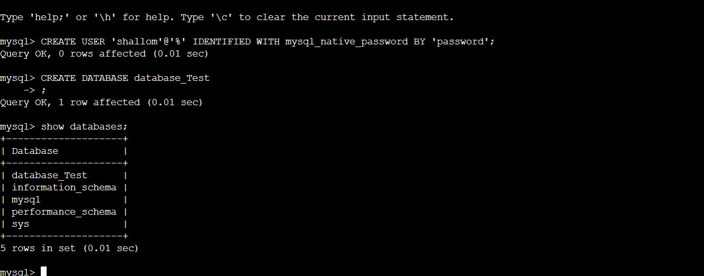
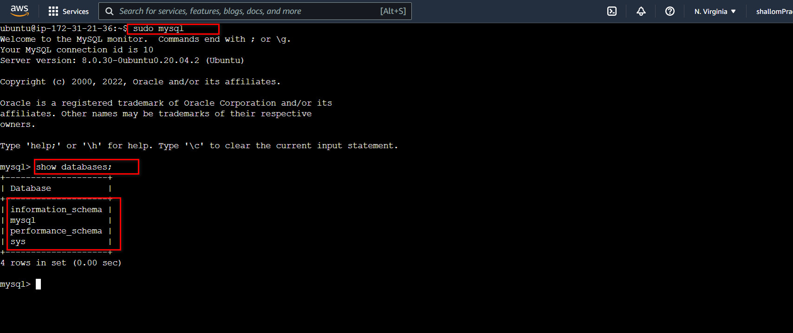

# Implementing a Client Server Architecture Using MySQL server and MYSQL client
#

## Project Architecture

To demonstrate Client-Server architecture we will be using two Ec2 instance with mysql-server and mysql-client respectively.
- Name one instance Mysql-server the other Mysql-client
  

Create and configure two Linux-based virtual servers (EC2 instances in AWS).  
**Note**: <u>Make sure they are both in same subnet</u>

On mysql server Linux Server install MySQL Server software.

On mysql client Linux Server install MySQL Client software.

Open port 3306 on Mysql-server allow for connection. Both server can communicate using private IPs since they belong to the same subnet

Change bind-address on Mysql-server to allow for connection from any IP address. Set the bind-address to 0.0.0.0 using the command below:

sudo vi /etc/mysql/mysql.conf.d/mysqld.cnf

Configure MysQL server and create database and user
- Set up password with `sudo mysql_secure_installation` and create a user
- Create database
    
    
    

- grant all permission on database
    
    

From mysql client Linux Server connect remotely to mysql server Database Engine without using SSH. You must use the mysql utility to perform this action.
    

Check that you have successfully connected to a remote MySQL server and can perform SQL queries. You should something similar to the screenshot below: