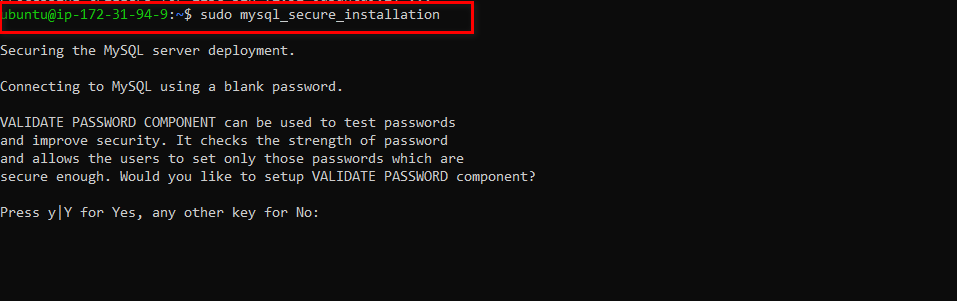
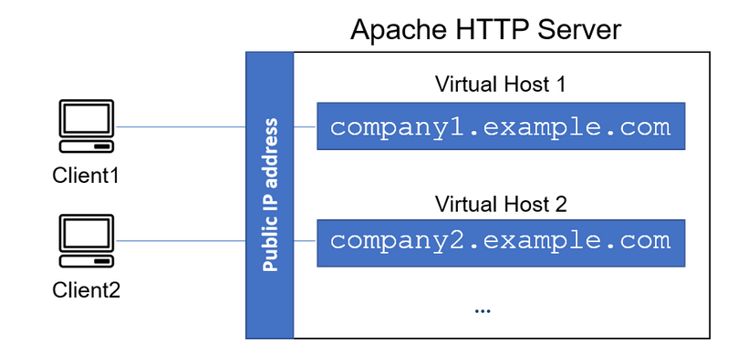
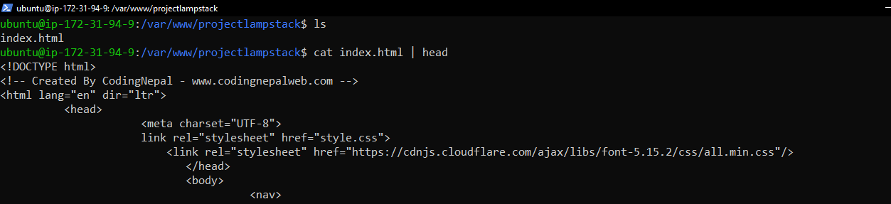
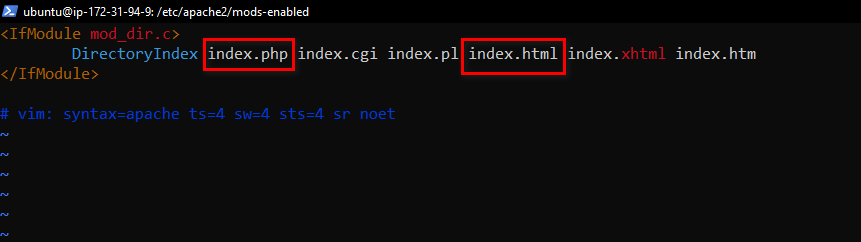
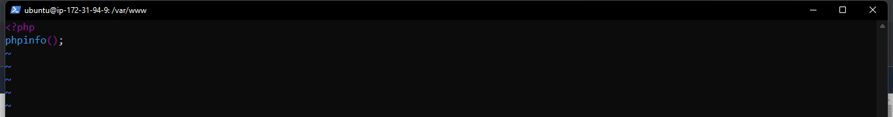

# Deploying a LAMP Stack Web Application on AWS Cloud
***
A LAMP Stack is a solution stack that is being used in deploying web applications. It stands for Linux, Apache, MySql and php,perl or python. 

**Linux**: this is an operating system which serves as the backbone of the LAMP Stack, and it is actively used in deploying other components.

**Apache**: is a web server software which via HTTP requests processes requests and transmits information via the internet.

**MySQL**: use for creating and maintaining dynamic databases. It supports SQL and relational tables and provides a DBMS(Database Management System).

**PHP,PERL or PYTHON**: this represents programming languages which effectively combines all the elements of the LAMP stack and is used to make web applications execute.

## Creation of EC2 Instance
First we log on to AWS Cloud Services and create an EC2 Ubuntu VM instance. When creating an instance, choose keypair authentication and `download private key(*.pem)` on your local computer.


On windows terminal, `cd` into the directory containing the downloaded private key.Run the below command to log into the instance via ssh: <br/>

`ssh -i <private_keyfile.pem> username@ip-address`

Successful login into ec2 instance:

## Setting Up Apache Web Server

To deploying the web application, we need toinstall apache via ubuntu package manager `apt`:
```
#Updating Packages
$ sudo apt update

$ sudo apt install apache2
```


```
#starting apache2 Server
$ systemctl start apache2

#ensuring apache2 starts automatically on system boot
$ systemctl enable apache2

#checking server spunned
$ systemctl status apache2
```


If it shows a green text, it means the web server has been successfully spunned and is live.

## Configuring Security Group Inbound Rules on EC2 Instance
A Security group is a group of rules that acts as a virtual firewall to the type of traffic that enters (inbound traffic) or leaves (outbound traffic) an instance.

When the instance is created, we have a default TCP rule on port 22 opened which is useful for SSH connection to a terminal.
In order to ensure that our webpage are being acccessed on the internet, we need to open a TCP port 80 inbound rule.


To check the accessiblity of our web server on the internet, we `curl` the IP address/DNS name of our localhost.
```
curl http://127.0.0.1:80  or curl http://localhost:80
```


To see if our web application server can respond to requests , use the public ip address of our instance on a web browser.
`http://<Public-IP-Address>:80` 


## Installing MySQL
We use MySQL as a relational database to store and manage data on our site. 

Install mysql using the `sudo apt install mysql` command. 


Use the `sudo mysql_secure_installation` command to remove insecure default settings and enable protection for the database.



On successful secure configuration, `sudo mysql`  on the terminal to have access to the MySQL DB.


Exit from the MySQL terminal by typing `exit`.

## Installing PHP and its Modules
PHP serves as a programming language which is useful for dynamically displaying contents of the webpage to users who make requests to the webserver.

We need to install php alongside its modules, `php-mysql` which is php module that allows php to communicate with the mysql database, `libapache2-mod-php` which ensures that the apache web server handles the php contents properly.

`sudo apt install php php-mysql libapache2-mod-php`.


On successfull installation of php and its modules we can check the version to see if it was properly installed. <br/>
` php -v `


## Deploying Our Site on Apache's VirtualHost

Next we set up a virtual host using apache to enable us deploy our webcontent on the webserver. Apache's virtualhosting ensures that one or more websites can run on a webserver via different IP addresses.



### Creating Web Domain For Our Site
Apache webserver serves a website by the way of server blocks inside its `/var/www/` directory, and it can support multiple of this server blocks to host other websites. 

Here we create a new directory called `projectlampstack` inside the `/var/www/` directory. <br/>
`sudo mkdir /var/www/projectlampstack`

The we change permissions of the `projectlampstack` directory to the current user system

`sudo chown -R $USER:$USER /var/www/projectlampstack`


The projectlampstack directory represents the directory which will contains files related to our website as it represents a new server block on the apache webserver. In order to spin up this server block we need to configure it by creating a `.conf` file. 

`sudo vi /etc/apache2/sites-available/projectlampstack.conf`

The following represents the configuration needed to spin up the server block. Copy and paste into the editor.


Run `esc :wq ` to save and terminate vi editor.

Run `sudo a2ensite projectlampstack` to activate the server block. 

Run `sudo a2dissite 000-default` to deactivate the default webserver block that comes with apache on default.

Reload the apache2 server `sudo systemctl reload apache2`


Create an index.html file inside the `/var/www/projectlampstack` 



Go to the broswer and open the webpage
`http://<public_ip_address>:80`


The webpage can also be opened using the DNS name of the ubuntu EC2 instance


By default, the webserver has a preference for serving an index.html file based on the order of precedence by default in the DirectoryIndex settings of Apache.<br/>
 To serve an index.php containing the server-side code, you’ll need to edit the `/etc/apache2/mods-enabled/dir.conf` file and change the order in which the index.php file is listed within the DirectoryIndex.

 

 Run the `sudo systemctl reload apache2` to restart the apache2 web server for the changes made to the DirectoryIndex to take effect.

 Create an index.php file in our webserver block and add the following code using the vim editor

 ```
 <?php
 phpinfo();
 ```
 

 Input the instance public ip address on a web browser

 .

