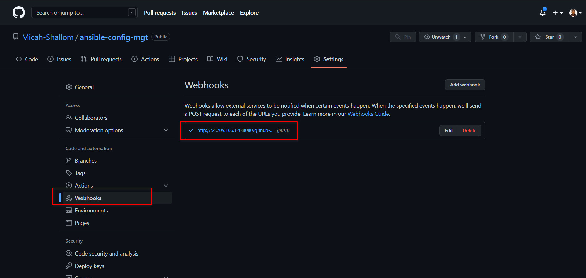
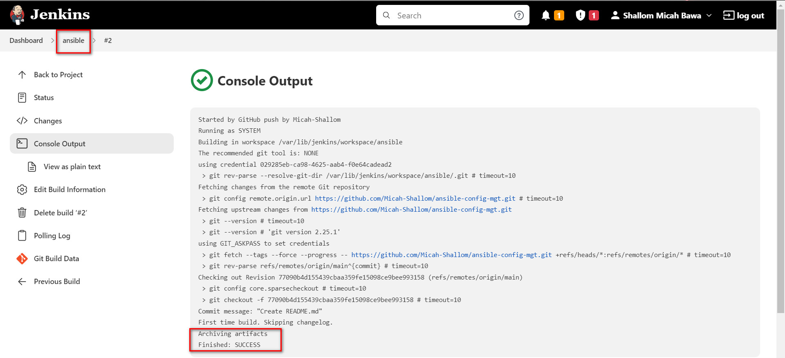
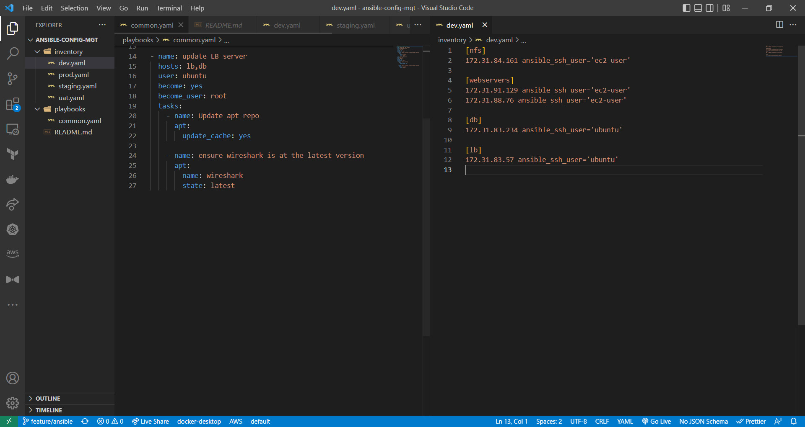

#


## Installing Ansible on Jenkins Server
We install ansible on our jenkins server and rename it to `Jenkins-Ansible`

```
sudo apt update

sudo apt install ansible
```


#

Create a new repository called `ansible-config-mgt` on github and set up webhooks on it.

`https://<jenkins_url:port/github-webhooks>`

On the Jenkins server, create a job called `ansible` and configure automatic builds when a trigger is made on the `ansible-config-mgt` directory via GITScm polling.



Test configuration by updating a README file on github.


## Prepare Development using VSCode
#
Download and install vscode which will be used to write and edit code.

## Ansible Configuration
#
Clone `ansible-config-mgt` repo on local machine and create a new branch for development 


- Create a playbooks directory for storing playbooks
- Create an inventory directory for storing inventory files
- In the playbooks folder, create a common.yml file
- In the inventory folder, create dev.yml, prod.yml, staging.yml and uat.yml for dev, prod, staging and uat environments respectively.



## Setting Up Inventory
we create inventories to execute Linux commands on remote hosts, and ensure that it is the intended configuration on a particular server that occurs. It is important to have a way to organize our hosts in such an Inventory.

We need to ssh into our target servers defined in the /inventory/dev.yaml

using SSH-Agent to upload our ssh public key to the jenkins-ansible server

```
eval `ssh-agent -s`
ssh-add <path-to-private-key>
```
Confirm the key has been added with the command below, you should see the name of your key
```
ssh-add -l
```
Now, ssh into your Jenkins-Ansible server using ssh-agent
```
ssh -A ubuntu@public-ip
```

updating our /inventory/dev.yaml
```
[nfs]
<NFS-Server-Private-IP-Address> ansible_ssh_user='ec2-user'

[webservers]
<Web-Server1-Private-IP-Address> ansible_ssh_user='ec2-user'
<Web-Server2-Private-IP-Address> ansible_ssh_user='ec2-user'

[db]
<Database-Private-IP-Address> ansible_ssh_user='ec2-user' 

[lb]
<Load-Balancer-Private-IP-Address> ansible_ssh_user='ubuntu'
```

## Creating a Common Playbook

Update code in /playbooks/common.yaml
```
 ---
- name: update web, nfs and db servers
  hosts: webservers, nfs, db
  remote_user: ec2-user
  become: yes
  become_user: root
  tasks:
    - name: ensure wireshark is at the latest version
      yum:
        name: wireshark
        state: latest

- name: update LB server
  hosts: lb
  remote_user: ubuntu
  become: yes
  become_user: root
  tasks:
    - name: Update apt repo
      apt: 
        update_cache: yes

    - name: ensure wireshark is at the latest version
      apt:
        name: wireshark
        state: latest
```

Next push code into repository and create a pull request to the main branch. Jenkins checksout the code and builds an artifact that is published on the ansible server.

## RUN FIRST ANSIBLE TEST
#
`ansible-playbook -i /var/lib/jenkins/jobs/ansible/builds/<build-number>/archive/inventory/dev.yml /var/lib/jenkins/jobs/ansible/builds/<build-number>/archive/playbooks/common.yml`

