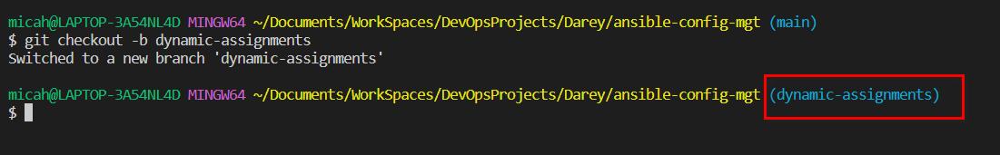
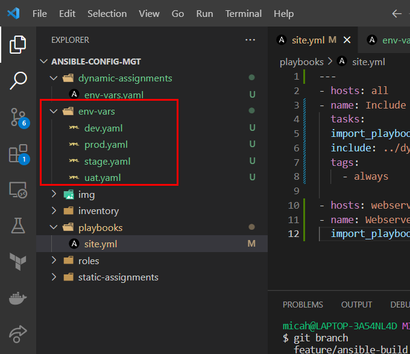
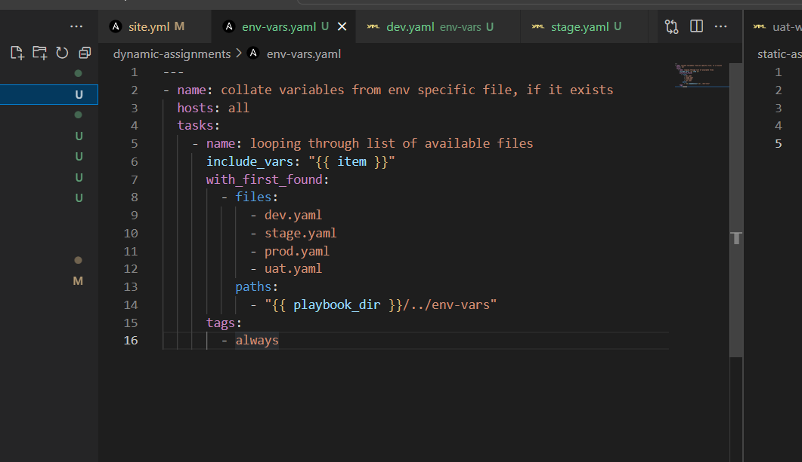
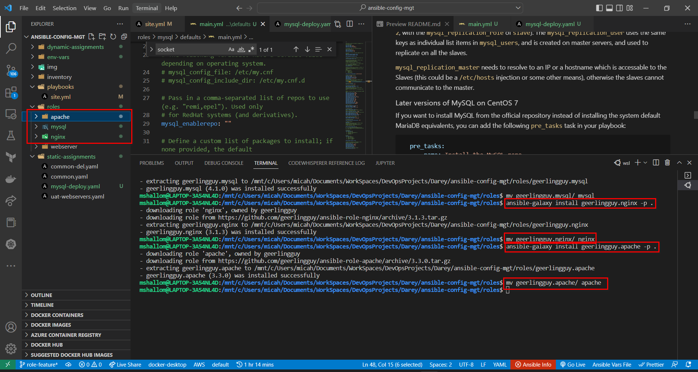
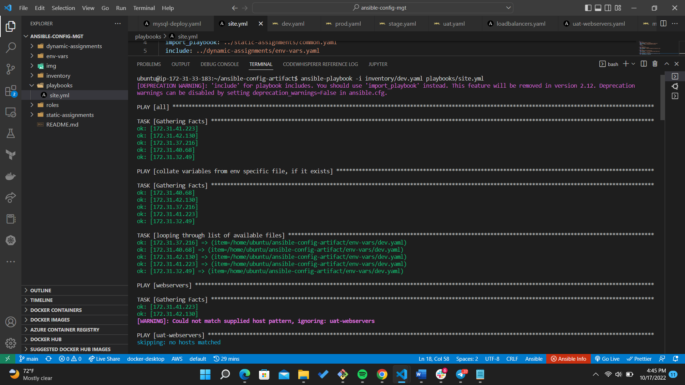

# ANSIBLE DYNAMIC ASSIGNMENTS (INCLUDE) AND COMMUNITY ROLES
#

In this project, we introduced the concept of the use of Dynamic assignments. The major difference between static and dynamic assignments is in the use of `import and include ststements.`

Include does similar thing as Imports but differs because it is dynamic. Dynamic in the sense that ansible is able pick changes in playbooks added to a master playbook in real time. In import ansible preprocesses everything runs the playbook with the data it has. Changes made while executing the playbook is ignored.

Created a role-feature branch to implement the dynamic assignments  of ansible

Set up environment vars which contains variables perculiar to each environment

Apply the following configuration to the env_vars.yaml file in the dynamic ssignments folder

Using ansible galaxy, installing configuration roles for apache and nginx. This configurations have been pre-written and referenced inside our static-assignments.

Running ansible-playbook on entry-point site.yml which loops through env_vars.yaml and conditionally applies configurations based on specified variables in each environment.

