# CI/CD PIPELINE FOR A PHP BASED APPLICATION

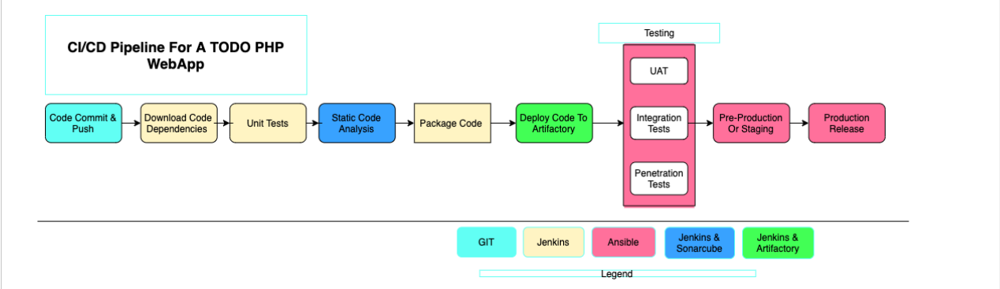

## Project Description:

In this project, I will be setting up a CI/CD Pipeline for a PHP based application. The overall CI/CD process looks like the architecture above.

This project is architected in two major repositories with each repository containing its own CI/CD pipeline written in a Jenkinsfile
- **ansible-config-mgt REPO**: this repository contains JenkinsFile which is responsible for setting up and configuring infrastructure required to carry out processes required for our application to run. It does this through the use of ansible roles. **<u>This repo is infrastructure specific</u>**
- **PHP-todo REPO** : this repository contains jenkinsfile which is focused on processes which are <u>**application build specific**</u> such as building, linting, static code analysis, push to artifact repository etc

## Prerequisites

Will be making use of AWS virtual machines for this and will require 6 servers for the project which includes:
**Nginx Server**: This would act as the reverse proxy server to our site and tool. <br/>

**Jenkins server**: To be used to implement your CI/CD workflows or pipelines. Select a t2.medium at least, Ubuntu 20.04 and Security group should be open to port 8080 <br/>

**SonarQube server**: To be used for Code quality analysis. Select a t2.medium at least, Ubuntu 20.04 and Security group should be open to port 9000 <br/>

**Artifactory server**: To be used as the binary repository where the outcome of your build process is stored. Select a t2.medium at least and Security group should be open to port 8081 <br/>

**Database server**: To server as the databse server for the Todo application <br/>

**Todo webserver**: To host the Todo web application. <br/>
#

## Environments
Ansible Inventory should look like this

```
├── ci
├── dev
├── pentest
├── pre-prod
├── prod
├── sit
└── uat
```
#

## ANSIBLE ROLES FOR CI ENVIRONMENT
To automate the setup of `SonarQube` and `JFROG Artifactory`, we can use `ansible-galaxy` to install this configuration into our ansible roles which will be used and run against the `sonarqube server and artifactory server`.

We will see this in play later
#

## Configuring Ansible For Jenkins Deployment
#

We create a Jenkins-server with a t2.medium specification because we will be needing more compute power to run builds compared to the jenkins-server we have been using in project 13

### Prepare your Jenkins server
Connect to your Jenkins instance on VScod via SSH and set up SSH-agent to ensure ansible get the private jey required to connect to all other servers:

```
eval `ssh-agent -s`
ssh-add <path-to-private-key>
```

### Install the following packages and dependencies on the server:
- Install git : sudo apt install git 

- Clone down the Asible-config-mgt repository: git clone https://github.com/Micah-Shallom/ansible-config-mgt.git

- Install Jenkins and its dependencies. Steps to install Jenkins can be found here
 
- Configure Ansible For Jenkins Deployment. 
- Navigate to Jenkins URL: <Jenkins-server-public-IP>:8080

In the Jenkins dashboard, click on Manage Jenkins -> Manage plugins and search for Blue Ocean plugin. Install and open Blue Ocean plugin.

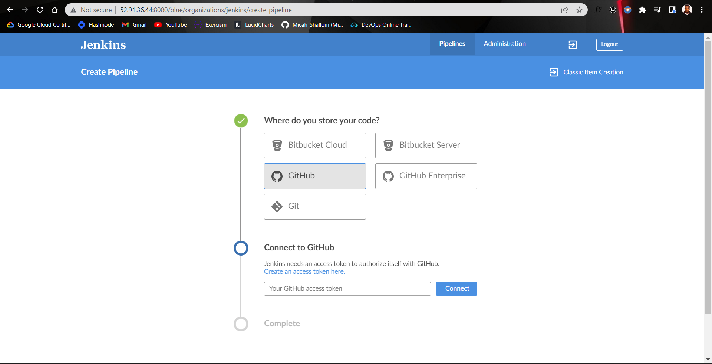

- Get personal access token from github
 
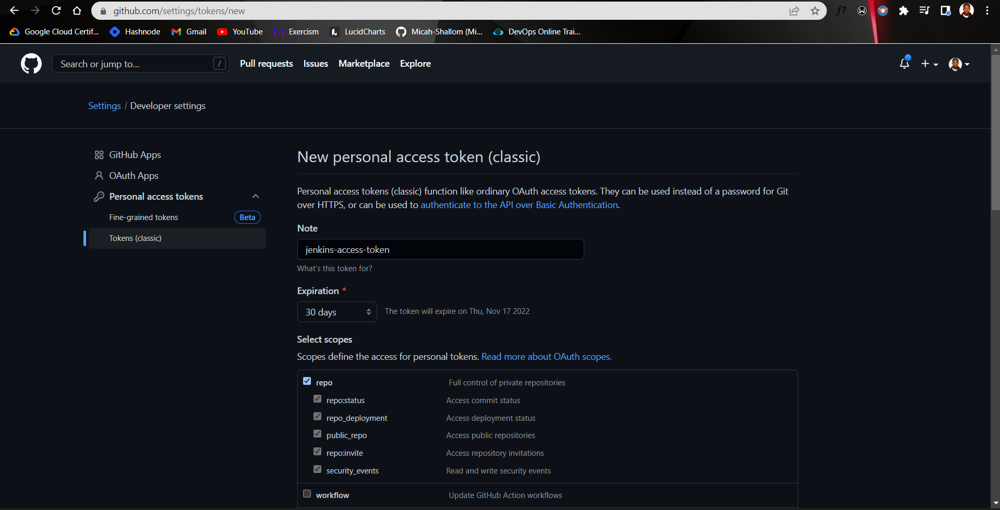

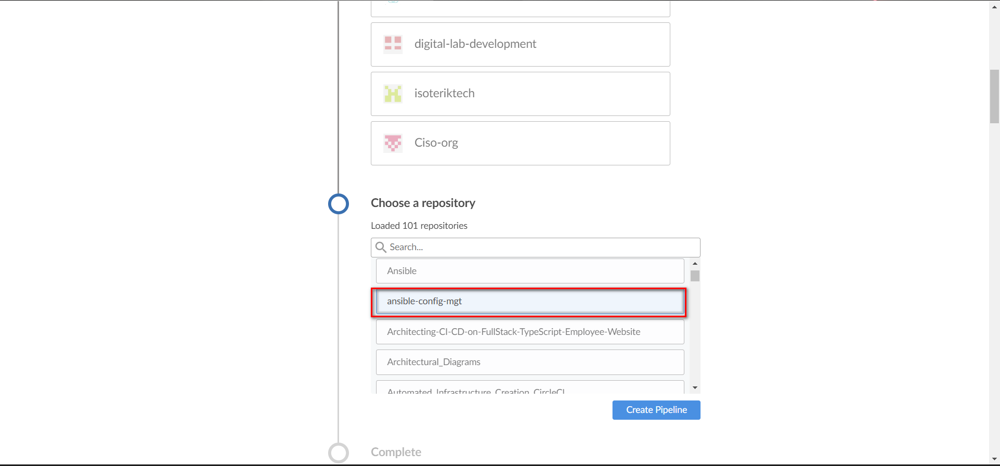

- This job gets created automatically by blue-ocean after connection with github repo.
  
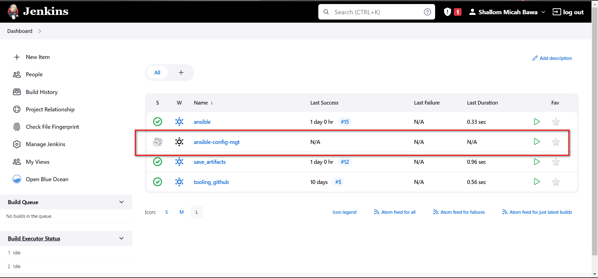
#

## Creating JENKINSFILE
- In Vscode, inside the Ansible project, create a new directory and name it deploy, create a new file Jenkinsfile inside the directory.
  
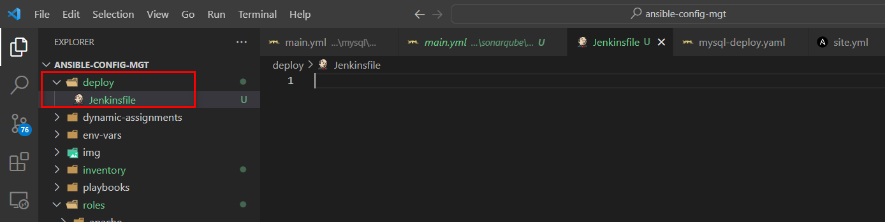

- Add the code snippet below to start building the Jenkinsfile gradually. This pipeline currently has just one stage called Build and the only thing we are doing is using the shell script module to echo Building Stage

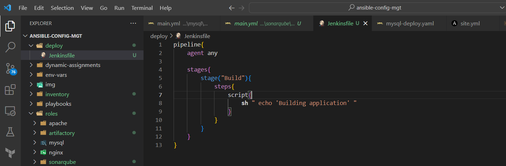

- Specify buildpath to help jenkins locate jenkinsfile
  
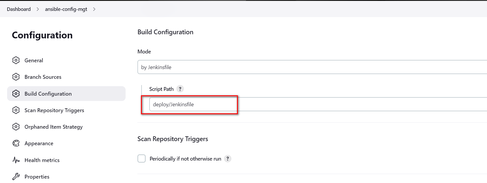

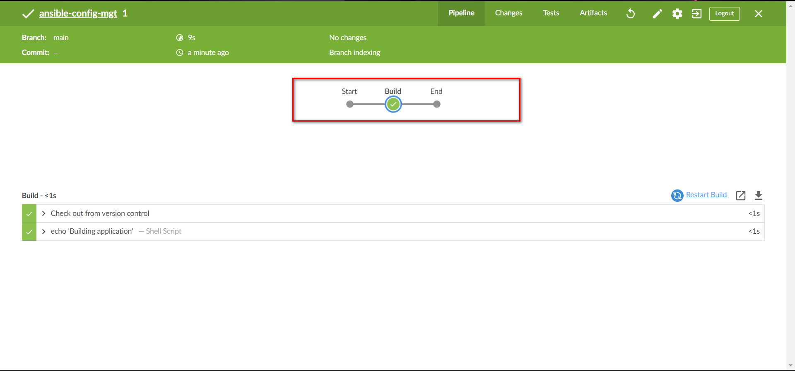

So Blue Ocean set up a multibranched pipeline after the initial connection with github. A multibranched pipeline is one which contains multiple branches depending on the github repository.

- To test this out we create new branch 
  
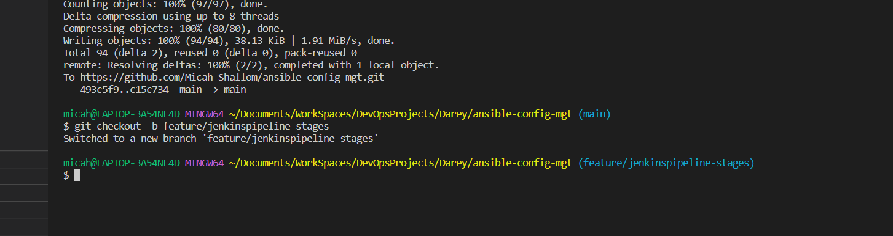

Add some more code to the jenkinsfile of the new branch which should contain a TEST build job and run it.


#

## RUNNING ANSIBLE PLAYBOOK FROM JENKINS
#

Install Ansible on Jenkins Jenkins-Ansible Server. <br/>

Install Ansible plugin in Jenkins UI <br/>

Create Jenkinsfile from scratch. (Delete all you currently have in there and start all over to get Ansible to run successfully) Note: Ensure that Ansible runs against the Dev environment successfully. <br/>

Add the following code to the jenkinsfile

```
pipeline {
  agent any

  environment {
      ANSIBLE_CONFIG="${WORKSPACE}/deploy/ansible.cfg"
    }

  stages {
      stage("Initial cleanup") {
          steps {
            dir("${WORKSPACE}") {
              deleteDir()
            }
          }
        }

      stage('Checkout SCM') {
         steps{
            git branch: 'main', url: 'https://github.com/Micah-Shallom/ansible-config-mgt.git'
         }
       }

      stage('Prepare Ansible For Execution') {
        steps {
          sh 'echo ${WORKSPACE}' 
          sh 'sed -i "3 a roles_path=${WORKSPACE}/roles" ${WORKSPACE}/deploy/ansible.cfg'  
        }
     }

      stage('Run Ansible playbook') {
        steps {
           ansiblePlaybook become: true, credentialsId: 'private-key', disableHostKeyChecking: true, installation: 'ansible', inventory: 'inventory/dev, playbook: 'playbooks/site.yml'
         }
      }

      stage('Clean Workspace after build') {
        steps{
          cleanWs(cleanWhenAborted: true, cleanWhenFailure: true, cleanWhenNotBuilt: true, cleanWhenUnstable: true, deleteDirs: true)
        }
      }
   }

}
```
Some possible errors to watch out for:

- Ensure that the git module in Jenkinsfile is checking out SCM to main branch instead of master (GitHub has discontinued the use of Master)

- Jenkins needs to export the ANSIBLE_CONFIG environment variable. You can put the .ansible.cfg file alongside Jenkinsfile in the deploy directory. This way, anyone can easily identify that everything in there relates to deployment. Then, using the Pipeline Syntax tool in Ansible, generate the syntax to create environment variables to set. Enter this into the ancible.cfg file

```
timeout = 160
callback_whitelist = profile_tasks
log_path=~/ansible.log
host_key_checking = False
gathering = smart
ansible_python_interpreter=/usr/bin/python3
allow_world_readable_tmpfiles=true


[ssh_connection]
ssh_args = -o ControlMaster=auto -o ControlPersist=30m -o ControlPath=/tmp/ansible-ssh-%h-%p-%r -o ServerAliveInterval=60 -o ServerAliveCountMax=60 -o ForwardAgent=yes
```
- Remember that ansible.cfg must be exported to environment variable so that Ansible knows where to find **Roles**. But because you will possibly run Jenkins from different git branches, the location of Ansible roles will change. Therefore, you must handle this dynamically. You can use Linux Stream Editor sed to update the section roles_path each time there is an execution. You may not have this issue if you run only from the main branch.

- If you push new changes to Git so that Jenkins failure can be fixed. You might observe that your change may sometimes have no effect. Even though your change is the actual fix required. This can be because Jenkins did not download the latest code from GitHub. Ensure that you start the Jenkinsfile with a clean up step to always delete the previous workspace before running a new one. Sometimes you might need to login to the Jenkins Linux server to verify the files in the workspace to confirm that what you are actually expecting is there. Otherwise, you can spend hours trying to figure out why Jenkins is still failing, when you have pushed up possible changes to fix the error.

- Another possible reason for Jenkins failure sometimes, is because you have indicated in the Jenkinsfile to check out the main git branch, and you are running a pipeline from another branch. So, always verify by logging onto the Jenkins box to check the workspace, and run git branch command to confirm that the branch you are expecting is there.
- Parameterizing Jenkinsfile For Ansible Deployment. So far we have been deploying to dev environment, what if we need to deploy to other environments? We will use parameterization so that at the point of execution, the appropriate values are applied. To parameterize Jenkinsfile For Ansible Deployment, Update CI inventory with new servers
```
[tooling]
<SIT-Tooling-Web-Server-Private-IP-Address>

[todo]
<SIT-Todo-Web-Server-Private-IP-Address>

[nginx]
<SIT-Nginx-Private-IP-Address>

[db:vars]
ansible_user=ec2-user
ansible_python_interpreter=/usr/bin/python

[db]
<SIT-DB-Server-Private-IP-Address>
```
5. Update Jenkinsfile to introduce parameterization. Below is just one parameter. It has a default value in case if no value is specified at execution. It also has a description so that everyone is aware of its purpose.
```
pipeline {
    agent any

    parameters {
      string(name: 'inventory', defaultValue: 'dev',  description: 'This is the inventory file for the environment to deploy configuration')
    }
...
```
6. In the Ansible execution section of the Jenkinsfile, remove the hardcoded inventory/dev and replace with `${inventory}`

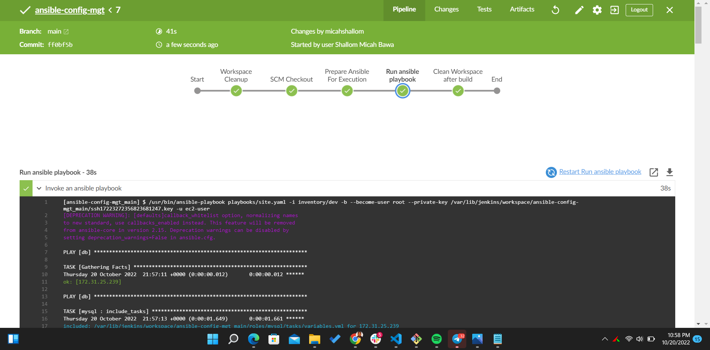
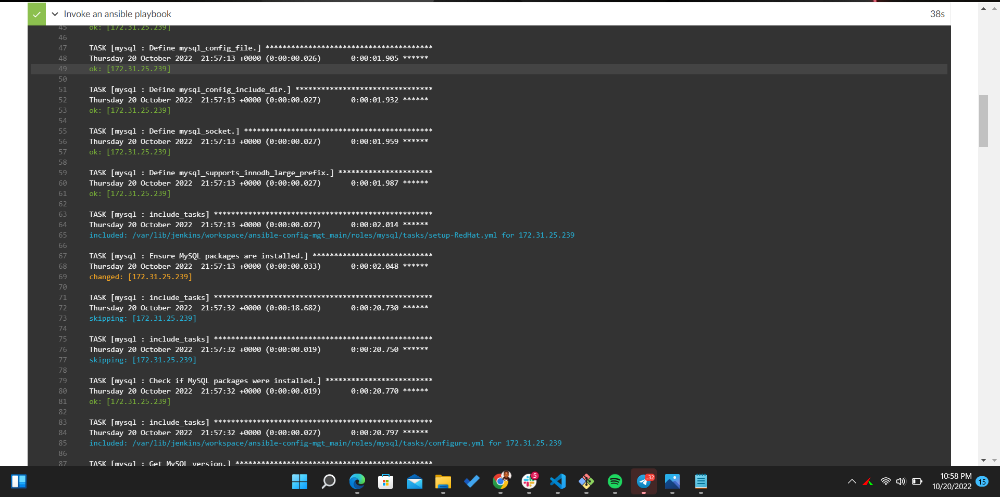
#

## CI/CD PIPELINE FOR TODO APPLICATION
#
Our goal here is to deploy the Todo application onto servers directly from Artifactory rather than from git.

- Updated Ansible with an Artifactory role, use this guide to create an Ansible role for Artifactory (ignore the Nginx part). 

- Now, open your web browser and type the URL https://. You will be redirected to the Jfrog Atrifactory page. Enter default username and password: admin/password. Once in create username and password and create your new repository. (Take note of the reopsitory name)

On our jenkins server, install git and then pull our php-todo application into our server
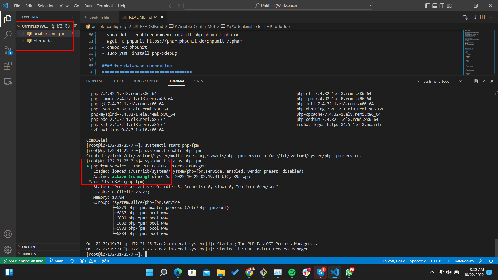