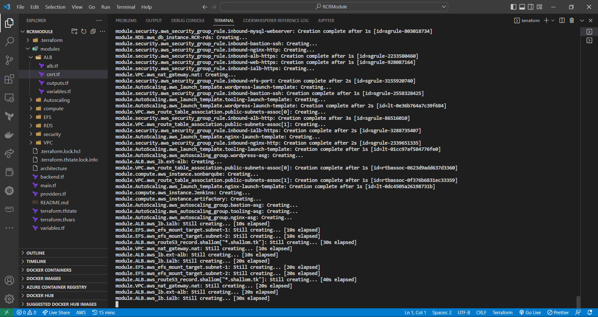
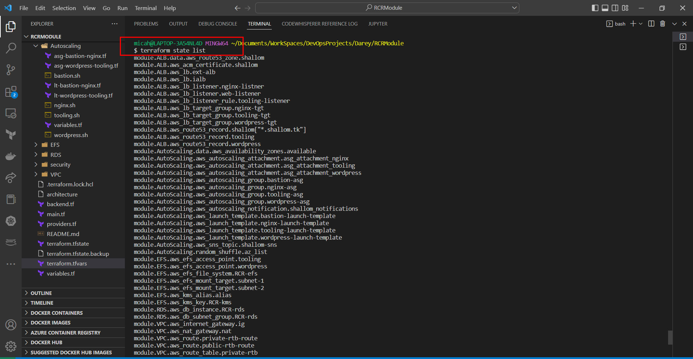
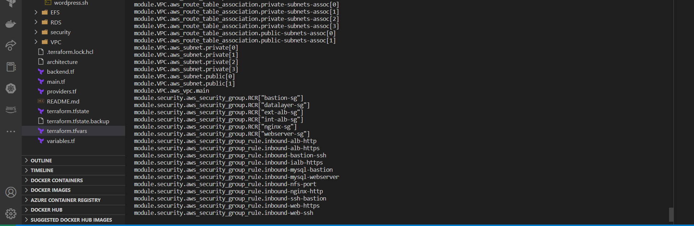

# AUTOMATE_INFRASTRUCTURE_WITH_IAC_TERRAFORM_PART3

In this project, we introduced the concept of modularization and packaged the terraform code for each innfrastructure into modules.

The implementation of terraform modularization for this project can be found in this repository

>>> >>> **[modular_code_repo](https://github.com/Micah-Shallom/RCR-MODULAR-TERRAFORM-ARCHITECTURE)**

