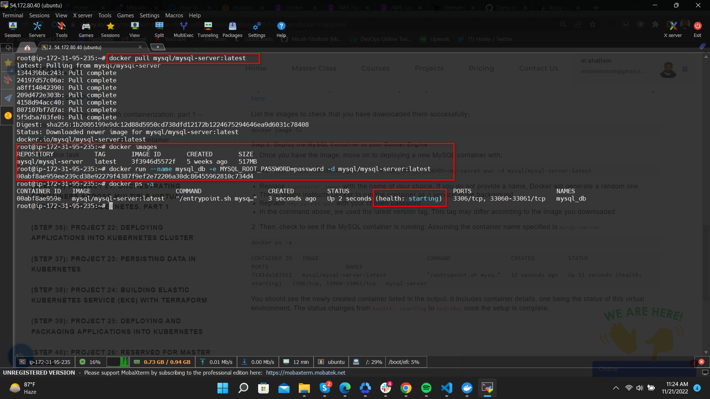
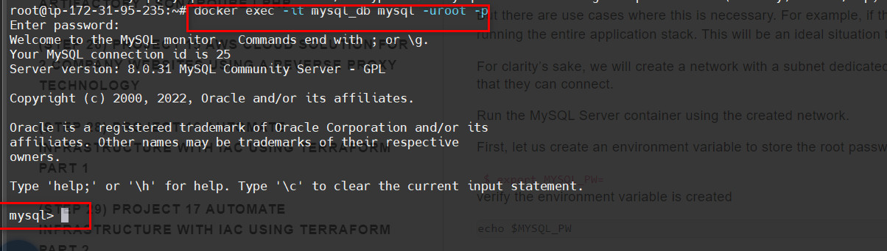
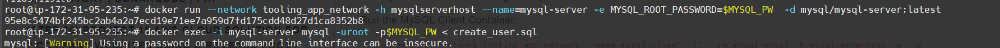
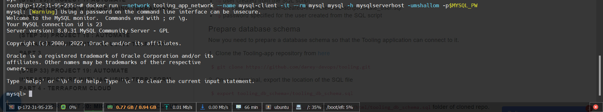
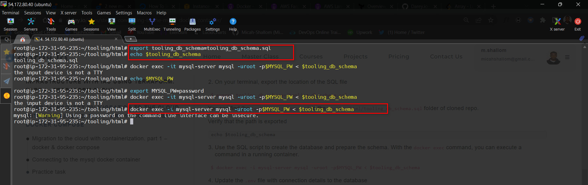

# MIGRATION TO THE СLOUD WITH CONTAINERIZATION

Until now, we have been using VMs (AWS EC2) in Amazon Virtual Private Cloud (AWS VPC) to deploy your web solutions, and it works well in many cases. 

We have learned how easy to spin up and configure a new EC2 manually or with such tools as Terraform and Ansible to automate provisioning and configuration.

 We have also deployed two different websites on the same VM; this approach is scalable, but to some extent; imagine what if you need to deploy many small applications (it can be web front-end, web-backend, processing jobs, monitoring, logging solutions, etc.) and some of the applications will require various OS and runtimes of different versions and conflicting dependencies – in such case you would need to spin up serves for each group of applications with the exact OS/runtime/dependencies requirements. When it scales out to tens/hundreds and even thousands of applications (e.g., when we talk of microservice architecture), this approach becomes very tedious and challenging to maintain.

In this project, we will learn how to solve this problem and practice the technology that revolutionized application distribution and deployment back in 2013! We are talking of Containers and imply Docker. Even though there are other application containerization technologies, Docker is the standard and the default choice for shipping your app in a container!

## Deploying Application Using Docker
#
### MySQL in container
### Step 1: Pull MySQL Docker Image from Docker Hub Registry

We pull the mysql image from the dockerhub repository(public) into our local server machine.

We run a container from this image and setup the mysqldb environment variables


`docker run --name <container_name> -e MYSQL_ROOT_PASSWORD=<my-secret-pw> -d mysql/mysql-server:latest`


#

## CONNECTING TO THE MYSQL DOCKER CONTAINER

We can either connect directly to the container running the MySQL server or use a second container as a MySQL client. Let us see what the first option looks like.

### Method 1

Connecting directly to the container running the MySQL server.
We can use the following commands to achieve this

```
$ docker exec -it mysql bash

or

$ docker exec -it mysql mysql -uroot -p
```
Provide the root password when prompted. With that, you’ve connected the MySQL client to the server.




### Method 2

At this stage you are now able to create a docker container but we will need to add a network. So, stop and remove the previous mysql docker container.

Run the MySQL Server container using a created network.

First, let us create an environment variable to store the root password:

$ export MYSQL_PW= 

Specify your password to be exported as environment variables

Verify the environment variable is created `echo $MYSQL_PW`

Then, pull the image and run the container, all in one command like below:

`docker run --network tooling_app_network -h mysqlserverhost --name=mysql-server -e MYSQL_ROOT_PASSWORD=$MYSQL_PW  -d mysql/mysql-server:latest`

This spins up a mysql client container and connects to the mysql-server via the mysqlserverhost connection



By executing into the client mysql container and run 

`mysql -uroot -h mysqlserverhost -p <password>`



As you already know, it is best practice not to connect to the MySQL server remotely using the root user. Therefore, we will create an SQL script that will create a user we can use to connect remotely.

Create a file and name it create_user.sql and add the below code in the file:

 $ CREATE USER 'mshallom'@'%' IDENTIFIED BY ''; 
 GRANT ALL PRIVILEGES ON * . * TO 'mshallom'@'%'; 

Run the script:
Ensure you are in the directory create_user.sql file is located or declare a path

`docker exec -i mysql-server mysql -uroot -p$MYSQL_PW < create_user.sql `

If you see a warning like below, it is acceptable to ignore:

`mysql: [Warning] Using a password on the command line interface can be insecure.`

