# SETTING UP A KUBERNETES CLUSTER FROM GROUND UP
#

To successfully implement "K8s From-Ground-Up", the following and even more will be done by you as a K8s administrator:

- Install and configure master (also known as control plane) components and worker nodes (or just nodes).
- Apply security settings across the entire cluster (i.e., encrypting the data in transit, and at rest)
- In transit encryption means encrypting communications over the network using HTTPS
- At rest encryption means encrypting the data stored on a disk
- Plan the capacity for the backend data store etcd
- Configure network plugins for the containers to communicate
- Manage periodical upgrade of the cluster
- Configure observability and auditing

## Let us begin building out Kubernetes cluster from the ground
#
**DISCLAIMER:** The following setup of Kubernetes should be used for **learning purpose only**, and not to be considered for production. This is because setting up a K8s cluster for production use has a lot more moving parts, especially when it comes to planning the nodes, and securing the cluster. The purpose of "K8s From-Ground-Up" is to get you much closer to the different components as shown in the architecture diagram and relate with what you have been learning about Kubernetes.

## Tools to be used and expected result of the Project 20
- VM: AWS EC2
- OS: Ubuntu 20.04 lts+
- Docker Engine / containerd
- kubectl console utility
- cfssl and cfssljson utilities

## Kubernetes cluster
You will create 6 EC2 Instances, and in the end, we will have the following parts of the cluster properly configured:

- 3 Kubernetes Master
- 3 Kubernetes Worker Nodes
- Configured SSL/TLS certificates for Kubernetes components to communicate securely
- Configured Node Network
- Configured Pod Network

#

# Introducing Project Architecture
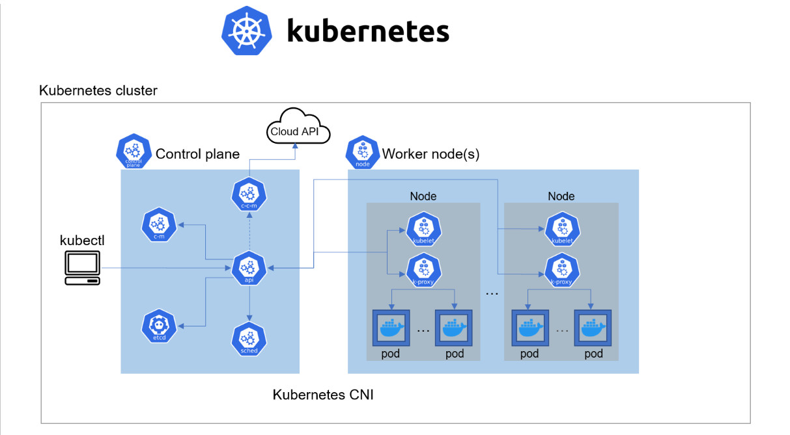
#

## STEP 0-INSTALL CLIENT TOOLS BEFORE BOOTSTRAPPING THE CLUSTER.
#

First, you will need some client tools installed and configurations made on your client workstation. In this case, my client workstation will be my local machine (**WSL UBUNTU 20.04**)

The following tools needs to configured on the client

- **awscli** – is a unified tool to manage your AWS services. Configure the access and secret keys on the client.
  
- **kubectl** – this command line utility will be your main control tool to manage your K8s cluster. 
- **cfssl** – an open source toolkit for everything TLS/SSL from Cloudflare
- **cfssljson** – a program, which takes the JSON output from the cfssl and writes certificates, keys, CSRs, and bundles to disk.
#

## Install kubectl
Kubernetes cluster has a Web API that can receive HTTP/HTTPS requests, but it is quite cumbersome to curl an API each and every time you need to send some command, so kubectl command tool was developed to ease a K8s administrator’s life.

With this tool you can easily interact with Kubernetes to deploy applications, inspect and manage cluster resources, view logs and perform many more administrative operations.

```
Download the binary

wget https://storage.googleapis.com/kubernetes-release/release/v1.21.0/bin/linux/amd64/kubectl
Make it executable

chmod +x kubectl
Move to the Bin directory

sudo mv kubectl /usr/local/bin/
```
#
## Install CFSSL and CFSSLJSON
cfssl is an open source tool by Cloudflare used to setup a Public Key Infrastructure (PKI Infrastructure) for generating, signing and bundling TLS certificates. In previous projects you have experienced the use of Letsencrypt for the similar use case. Here, cfssl will be configured as a Certificate Authority which will issue the certificates required to spin up a Kubernetes cluster.

Download, install and verify successful installation of cfssl and cfssljson:
```
wget -q --show-progress --https-only --timestamping \
  https://storage.googleapis.com/kubernetes-the-hard-way/cfssl/1.4.1/linux/cfssl \
  https://storage.googleapis.com/kubernetes-the-hard-way/cfssl/1.4.1/linux/cfssljson
chmod +x cfssl cfssljson
sudo mv cfssl cfssljson /usr/local/bin/
```
## AWS CLOUD RESOURCES FOR KUBERNETES CLUSTER
#
As we already know, we need some machines to run the control plane and the worker nodes. In this section, we will provision EC2 Instances required to run the K8s cluster. In this project, I made use of terraform to spin up the infrastructure for setting this up.

The following resources were setup:

- VPC
- DHCP 
- Internet Gateway
- Route Tables
- Security Groups for Cluster
- Network Load Balancer and Listener
- Target Groups
- 6 EC2 Instances 3 Master 3 Worker

# [Link to the terraform code ](https://github.com/Micah-Shallom/k8s-tf-network-setup.git)
#

## PREPARE THE SELF-SIGNED CERTIFICATE AUTHORITY AND GENERATE TLS CERTIFICATES
### The following components running on the Master node will require TLS certificates.
- kube-controller-manager
- kube-scheduler
- etcd
- kube-apiserver
  
### The following components running on the Worker nodes will require TLS certificates.
- kubelet
- kube-proxy

We will provision a **PKI** Infrastructure using cfssl which will have a Certificate Authority. The CA will then generate certificates for all the individual components.

### Self-Signed Root Certificate Authority (CA)
- We provision a CA that will be used to sign additional TLS certificates.

### Generating TLS Certificates For Client and Server

Using the CA, we provision TLS certs for the following
- kube-controller-manager
- kube-scheduler
- etcd
- kubelet
- kube-proxy
- Kubernetes Admin User

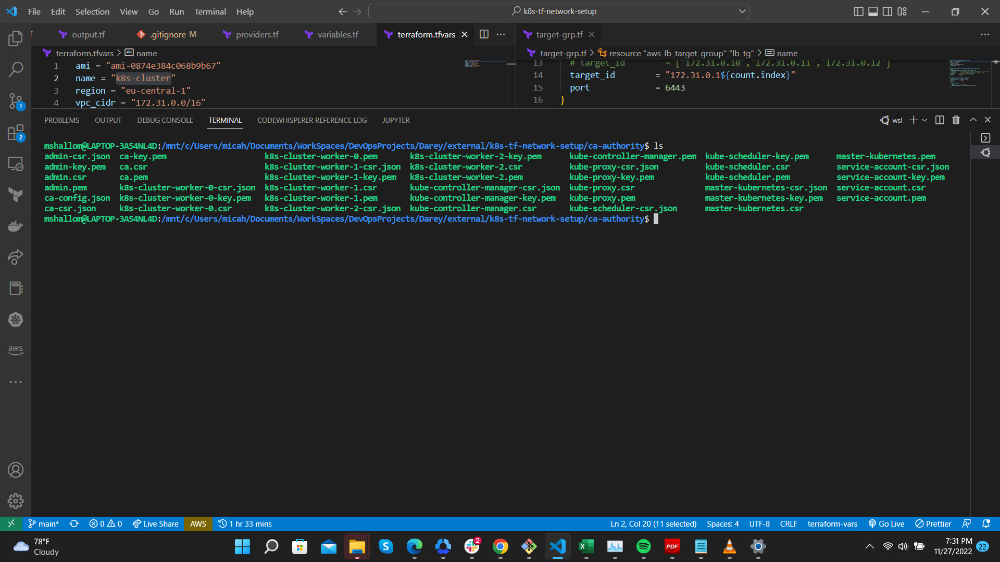

## Distributing the Client and Server Certificates
#
After creating all certifiates, now it is time to start sending all the client and server certificates to their respective instances.

### Sending to Worker Instance Servers
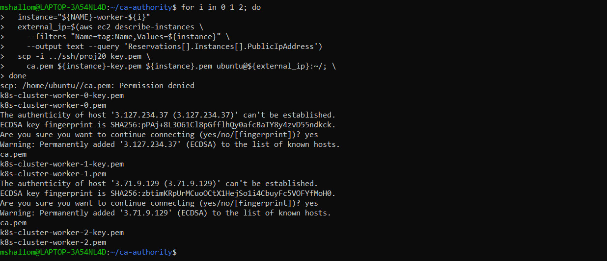

### Sending to Master Instance Servers
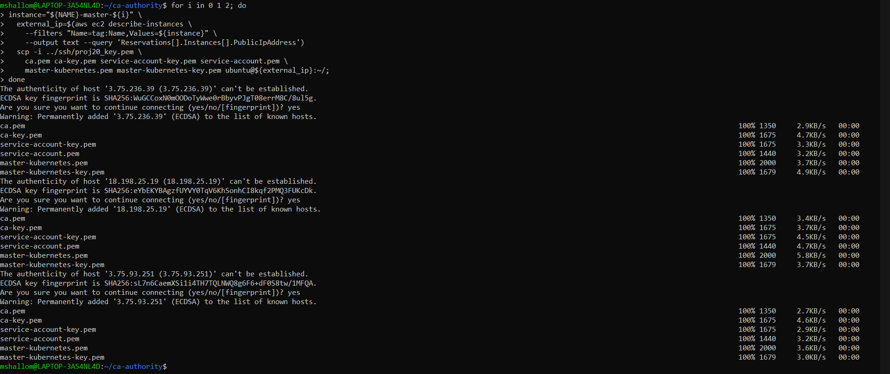
#

## USE `KUBECTL` TO GENERATE KUBERNETES CONFIGURATION FILES FOR AUTHENTICATION
We will be using Kubectl to generate kubeconfig files for the kubelet, controller manager, kube-proxy, and scheduler clients and then the admin user.

After creation, we send the respective kubeconfigs to either the master or worker nodes

### Sending kubeconfig to worker
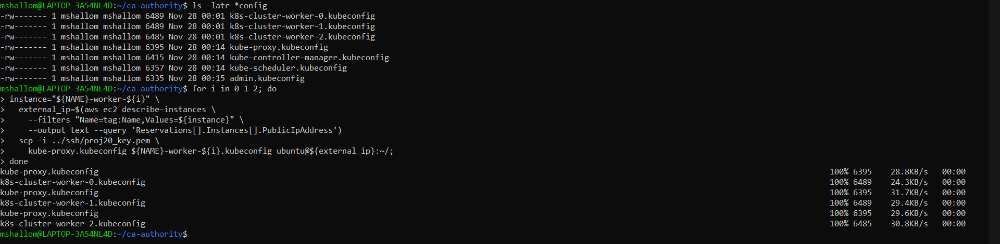

### Sending kubeconfig to master
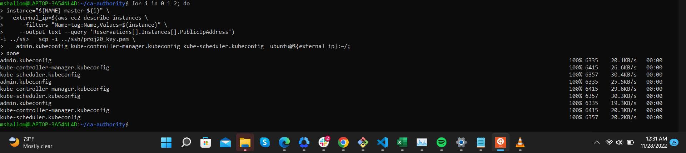


## PREPARE THE ETCD DATABASE FOR ENCRYPTION AT REST.
#
Kubernetes uses etcd (A distributed key value store) to store variety of data which includes the cluster state, application configurations, and secrets. By default, the data that is being persisted to the disk is not encrypted.

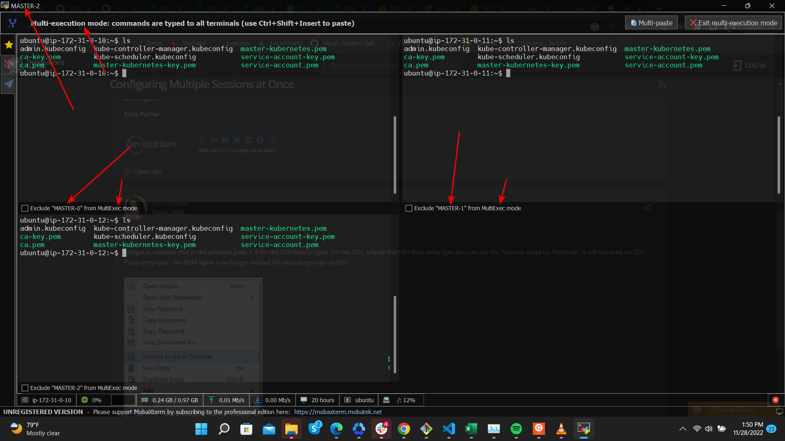
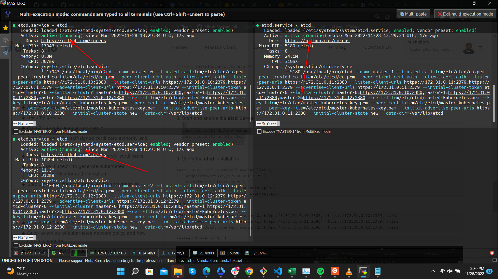

## BOOTSTRAP THE CONTROL PLANE
#
We will be doing additional installations for our control plane. 

- Configure the Kubernetes API Server
  
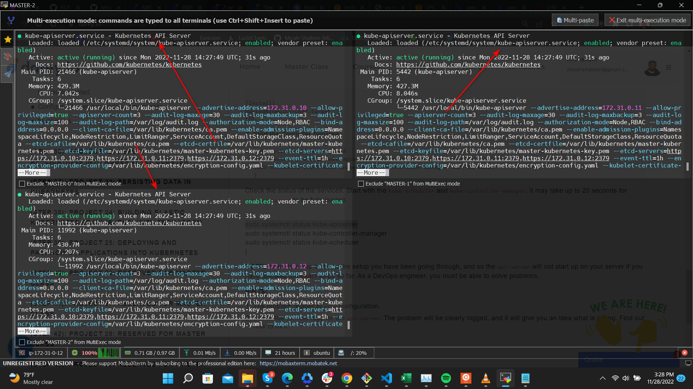

- Create the kube-apiserver.service systemd unit file
- Configure the Kubernetes Controller Manager:
  
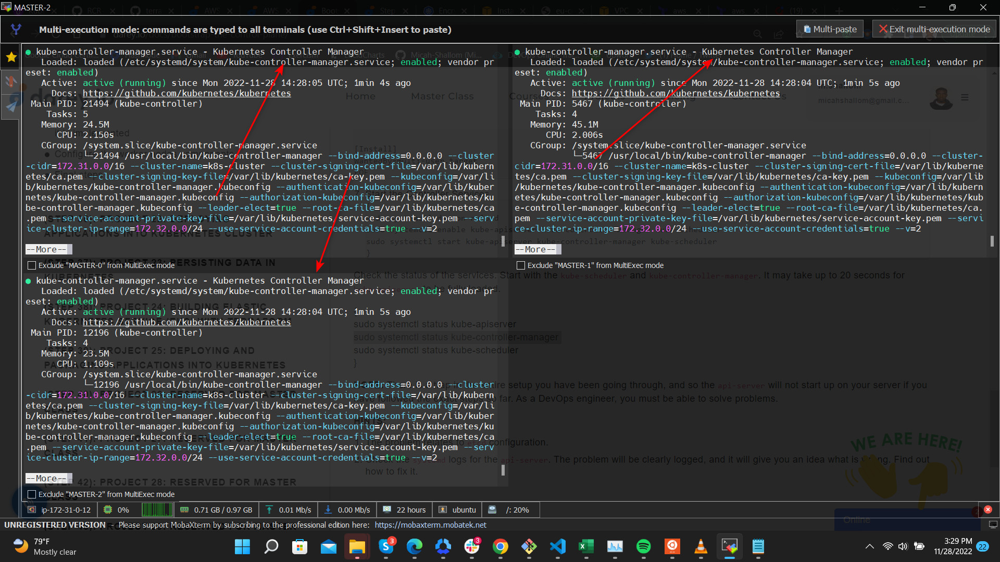
- Create the kube-controller-manager.service systemd unit file
- Configure the Kubernetes Scheduler
- Create the kube-scheduler.service systemd unit file
  
### Testing Everything works properly

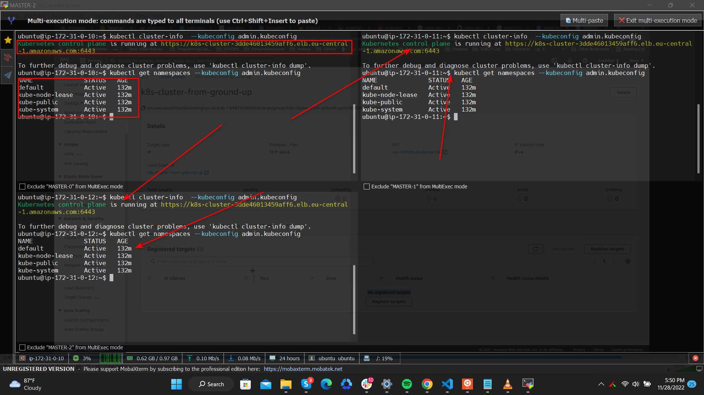
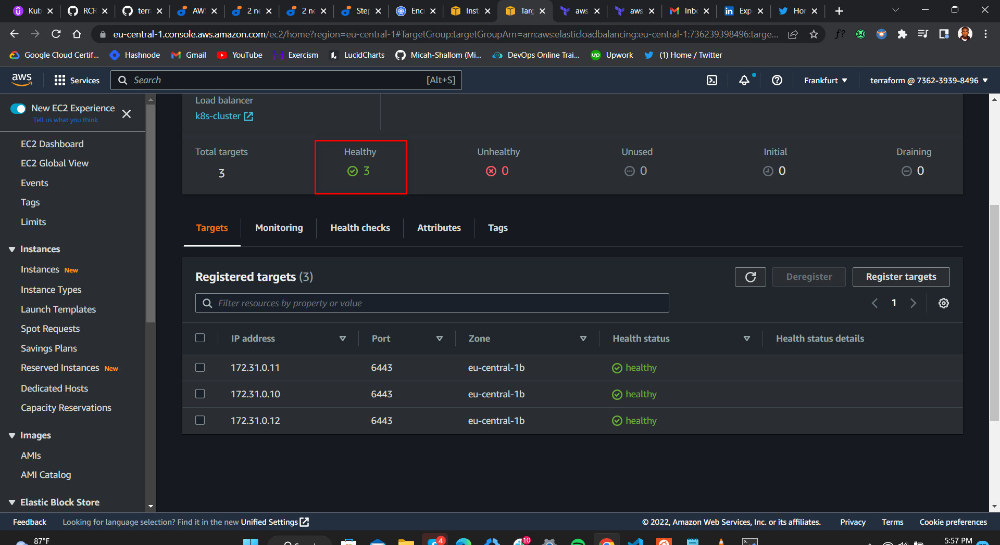

## CONFIGURING THE KUBERNETES WORKER NODES
#

The following components will be installed on each node:

kubelet
kube-proxy
Containerd or Docker
Networking plugins

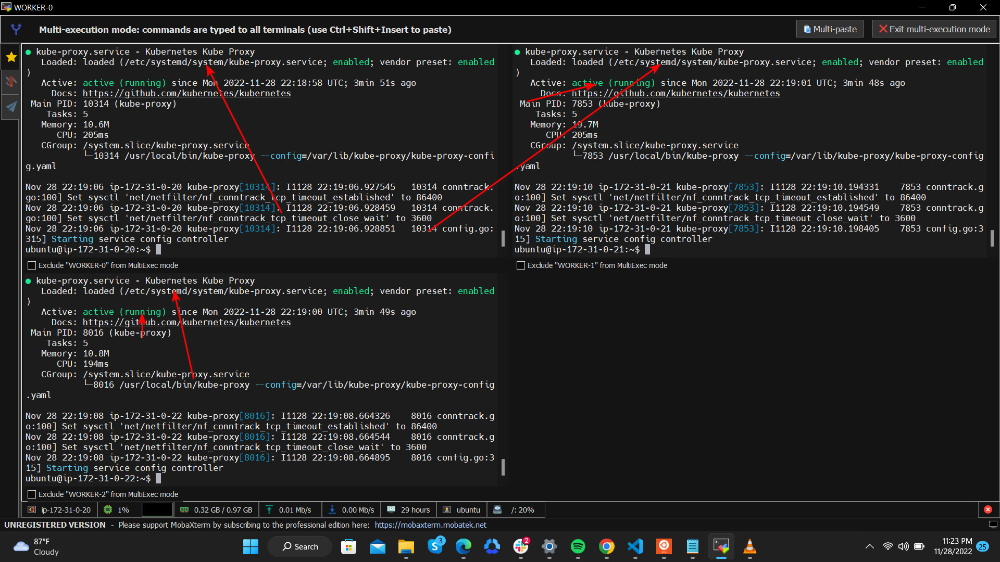
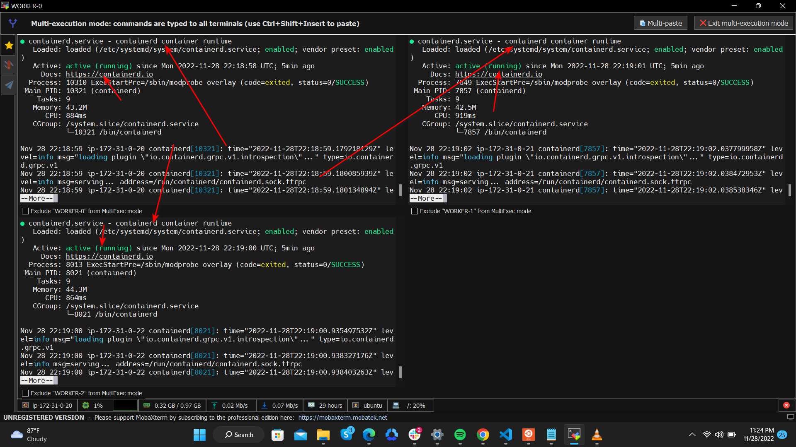


We run `kubectl get nodes --kubeconfig admin.kubeconfig` to test if our setup works. The ready state shows that our nodes are working properly

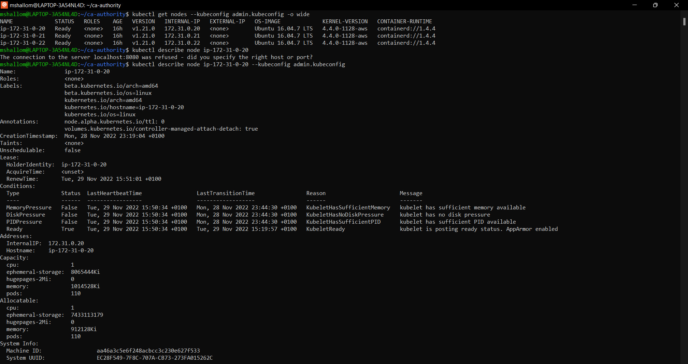