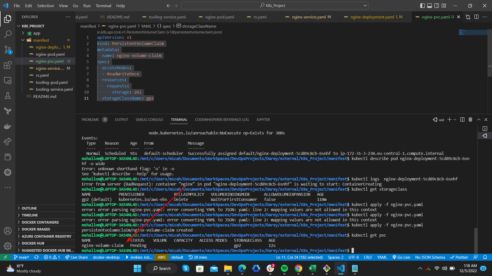
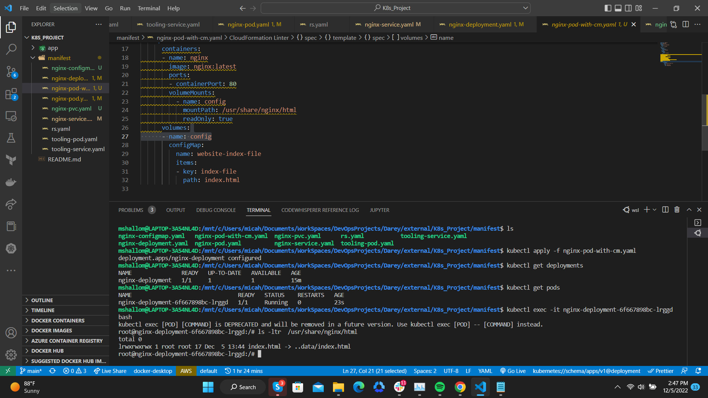
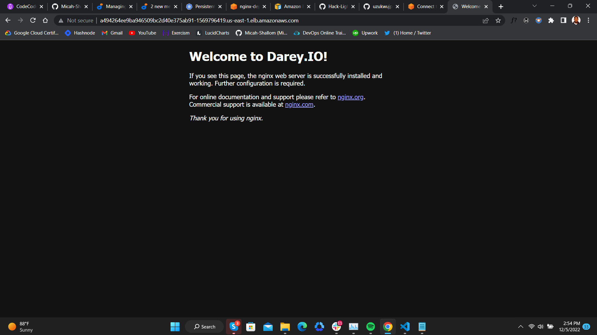

# PERSISTING DATA IN KUBERNETES
#

In this project, will be introducing the concept of Persistence in kubernetes using Persistent Volumes, Persistent Volumes Claims and Storage Classes

- A **PersistentVolume (PV)** is a piece of storage in the cluster that has been provisioned by an administrator or dynamically provisioned using Storage Classes. It is a resource in the cluster just like a node is a cluster resource. PVs are volume plugins like Volumes, but have a lifecycle independent of any individual Pod that uses the PV. This API object captures the details of the implementation of the storage, be that NFS, iSCSI, or a cloud-provider-specific storage system.

- A **PersistentVolumeClaim (PVC)** is a request for storage by a user. It is similar to a Pod. Pods consume node resources and PVCs consume PV resources. Pods can request specific levels of resources (CPU and Memory). Claims can request specific size and access modes (e.g., they can be mounted ReadWriteOnce, ReadOnlyMany or ReadWriteMany, see AccessModes).

- While PersistentVolumeClaims allow a user to consume abstract storage resources, it is common that users need PersistentVolumes with varying properties, such as performance, for different problems. Cluster administrators need to be able to offer a variety of PersistentVolumes that differ in more ways than size and access modes, without exposing users to the details of how those volumes are implemented. For these needs, there is the **StorageClass resource**.

## Prerequisites

- Setup an EKS Cluster on AWS
- Configure both cluster role and node group roles
  

### Running the deployments

#

### Checking the details of the pod

#

### Exec into the kubernetes pod and checking the nginx pod default.conf file

#

### Looking into the details of the cluster node and finding the availability zone in which a certain note got deployed into.

#

### Created an EBS volume to be connected to the deployment via the `awsElasticBlockStore`

#

### Creating a Persistent Volume Claim

#

### Checking out the deployed nginx default homepage

#

### Creating a configmap containing the default page as its userdata. This will be populated into created pods irrespective of whether it gets deleted or not.

#

### Changes made on the configmap userdata populated in each pod

#