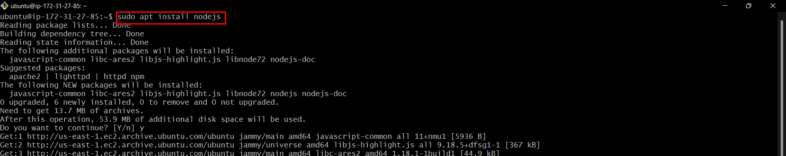
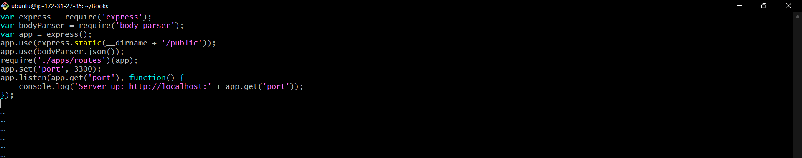
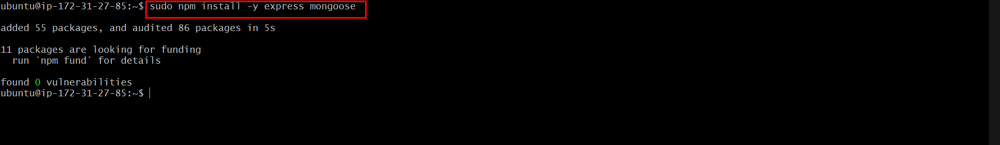
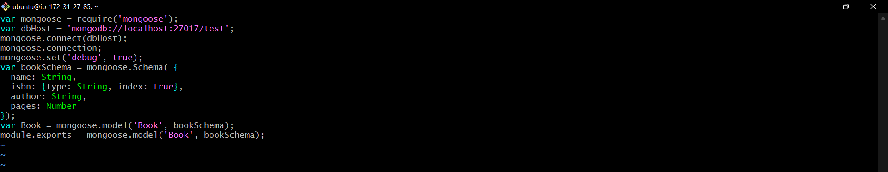
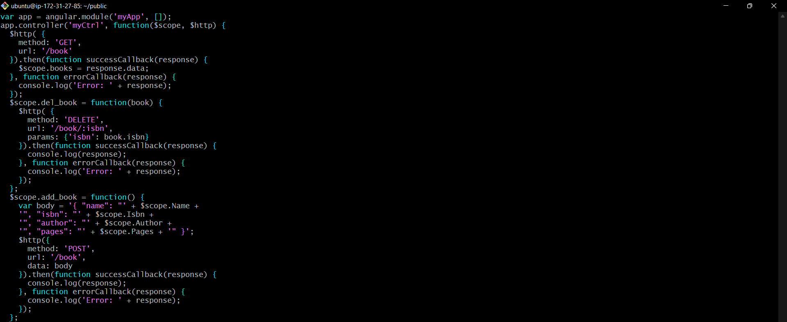
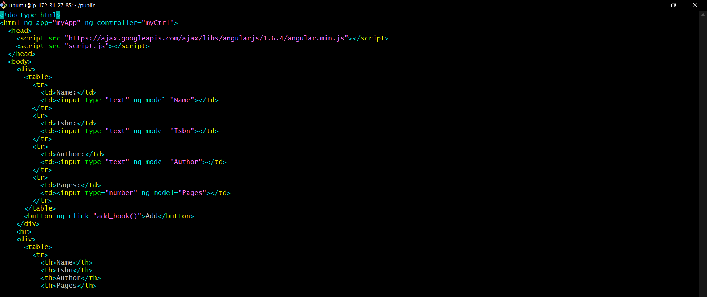
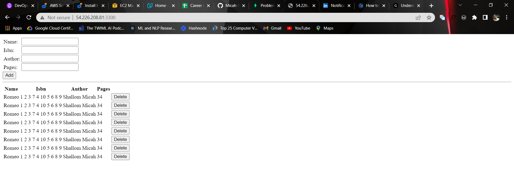

# Deploying a MEAN Stack Application on AWS Cloud

We create an aws EC2 instance, named `project mean`. This will serve as the backbone of our application deployment.


We then update and upgrade core dependencies on our linux backbone


Applying certificates and installing nodejs
```
sudo apt -y install curl dirmngr apt-transport-https lsb-release ca-certificates

curl -sL https://deb.nodesource.com/setup_12.x | sudo -E bash -
```


We then proceed to install mongodb which is a non-relational database which we will use to store our applications data.
```
sudo apt-key adv --keyserver hkp://keyserver.ubuntu.com:80 --recv 0C49F3730359A14518585931BC711F9BA15703C6

echo "deb [ arch=amd64 ] https://repo.mongodb.org/apt/ubuntu trusty/mongodb-org/3.4 multiverse" | sudo tee /etc/apt/sources.list.d/mongodb-org-3.4.list
```
```
sudo apt install -y mongodb

sudo systemctl start mongodb
sudo systemctl enable mongodb
sudo systemctl status mongodb

```


Install npm which is the default package manager for JavaScript's runtime Node.js.


Install body-parser


We create a `Books` directory and we initialize it as a npm project using `npm init`. Then create a `server.js` file and setup the server.


Installing express and mongoose which is a package which provides a straight-forward, schema-based solution to model your application data. We will use Mongoose to establish a schema for the database to store data of our book register.


In the books directory create a directory `apps` and create a `routes.js` file then append the code to it


Create a direcotry `models` in the boos directory and add a file `books.js` and append the code which contains the schema model


In the book directory create a `public` directory and create a `script.js` file which will contain our angular frontend code 


Create a `index.html` in the `public` directory and append the code


We move into the books directory and spin up the express server using `node server.js`


Configure security group inbound rules to allow our application to be accessible via the internet via our server port


On a browser, paste the public ip address of our instance to view the site
