# DevOps-Website-Solution
In previous project [Implementing Web Solution (https://github.com/Micah-Shallom/Implementing-Wordpress-Web-Solution)] I implemented a WordPress based solution that is ready to be filled with content and can be used as a full fledged website or blog. Moving further I will add some more value to my solution so that a member of a DevOps team could utilize.

In this project,, I will be introducing the concept of file sharing for multiple servers to share the same web content and also a database for storing data related to the website.

## <u>Architectural Design</u>


On the diagram above we can see a common pattern where several **stateless Web Servers** share a common database and also access the same files using **Network File Sytem (NFS)** as a shared file storage. Even though the NFS server might be located on a completely separate hardware – for Web Servers it looks like a local file system from where they can serve the same files.

This project consists of the following servers:
 - Web server(RHEL)
 - Database server(Ubuntu + MySQL)
 - Storage/File server(RHEL + NFS server)

# Preparing NFS Server

Create an EC2 instance (Red Hat Enterprise Linux 8 on AWS) on which we will setup our NFS(Network File Storage) Server. 

On this server we attach 2 EBS volumes 10GB each as external storage to our instance and create 3 logical volumes on it through which we will attach mounts from our external web servers.

- 3 logical volumes `lv-opt, lv-apps and lv-logs`
- 3 mount directory `/mnt/opt, /mnt/apps and /mnt/logs`
- Webserver content will be stores in /apps, webserver logs in /logs and /opt will be used by Jenkins

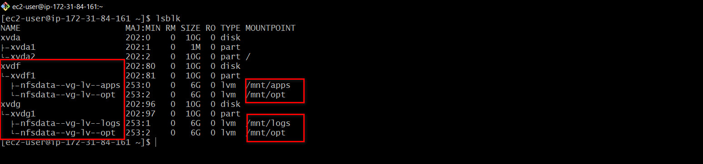
Steps taken to create logical volumes are shown in this [project](https://github.com/Micah-Shallom/Implementing-Wordpress-Web-Solution).


Installing nfs-server on the nfs instance and ensures that it starts on system reboot
``` 
sudo yum -y update
sudo yum install nfs-utils -y
sudo systemctl start nfs-server.service
sudo systemctl enable nfs-server.service
sudo systemctl status nfs-server.service
```
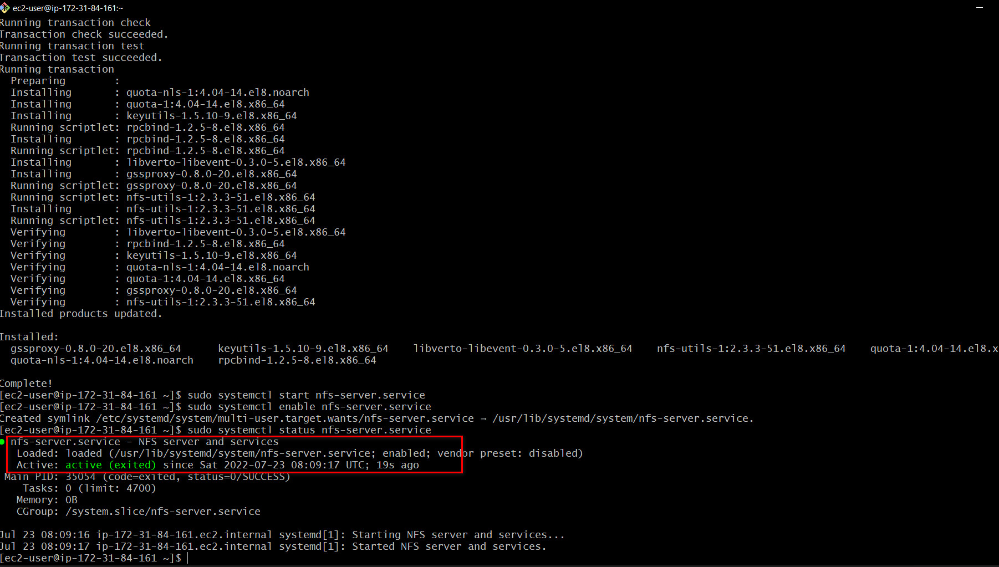

Set the mount point directory to allow read and write permissions to our webserver
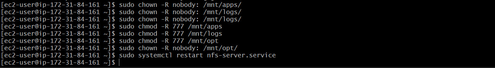
Restart NFS server `sudo systemctl restart nfs-server`

**Note: In this project, we will be creating our NFS-server, web-servers and database-server all in the same subnet**

Next we configure NFS to interact with clients present in the same subnet. <br/>

We can find the subnet ID and CIDR in the Networking tab of our instances

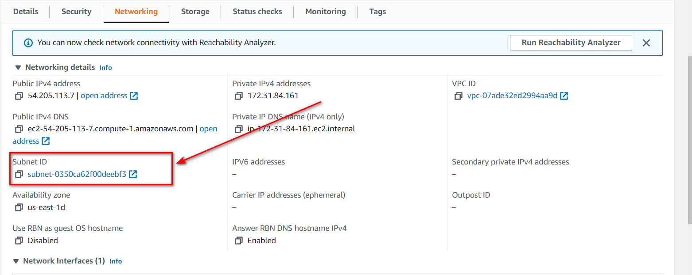

```
sudo vi /etc/exports

On the vim editor add the lines as seen in the image below

sudo exportfs -arv
```


To check what port is used by NFS so we can open it in security group

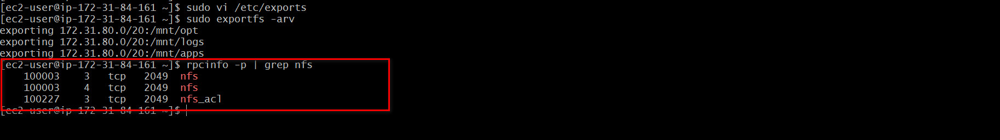

The following ports are to be open on the NFS server


# Preparing Database Server

Create an Ubuntu Server on AWS which will serve as our Database. Ensure its in the same subnet as the NFS-Server.

Install mysql-server 

```
sudo apt -y update
sudo apt install -y mysql-server

To enter the db environment run
sudo mysql
```

- Create a database and name it tooling
- Create a database user and name it webaccess
- Grant permission to webaccess user on tooling database to do anything only from the webservers `subnet cidr`


# Preparing Web Servers
Create a RHEL EC2 instance on AWS which serves as our web server. Also remember to have in it in same subnet

A couple of configurations will be done on the web servers:

- configuring NFS client
- deploying tooling website application
- configure servers to work with database

Installing NFS-Client


We will be connecting our `/var/www` directory to our webserver with the `/mnt/apps` on nfs server. This is acheived by mounting the NFS server directory to the webserver directory

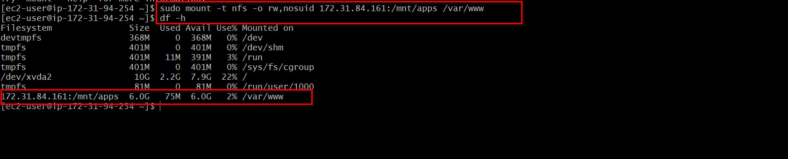

We then need to ensure that our mounts remain intact when the server reboots. This is achieved by configuring the fstab directory. <br/>
`sudo vi /etc/fstab` <br/>

add the following line `<NFS-Server-Private-IP-Address>:/mnt/apps /var/www nfs defaults 0 0`
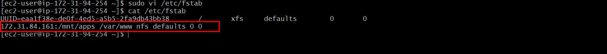

### Installing Apache and Php

```
sudo yum install httpd -y

sudo dnf install https://dl.fedoraproject.org/pub/epel/epel-release-latest-8.noarch.rpm

sudo dnf install dnf-utils http://rpms.remirepo.net/enterprise/remi-release-8.rpm

sudo dnf module reset php

sudo dnf module enable php:remi-7.4

sudo dnf install php php-opcache php-gd php-curl php-mysqlnd

sudo systemctl start php-fpm

sudo systemctl enable php-fpm

setsebool -P httpd_execmem 1
```

We can see that both `/var/www and /mnt/apps` contains same content. This shows that both mount points are connected via NFS.


We locate the log folder for Apache on the Web Server and mount it to NFS server’s export for logs. Make sure the mount point will persist after reboot.

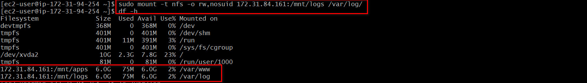
On the `/etc/fstab` persist log mount point

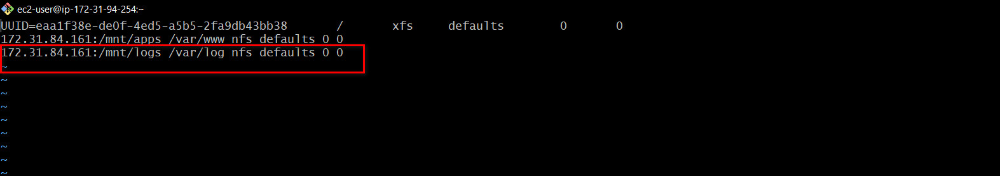

On the NFS Server, add web content into the `/mnt/apps` directory. This should contain a html folder. The same content will be present in the `/var/www` directory in the web server.

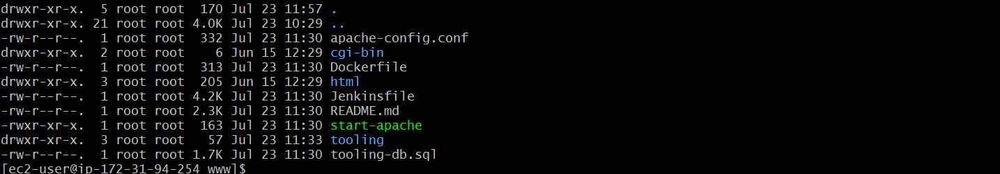

Run `<public_ip_address>/index.php` on a web browser to access the site. Use public_ip_address of the web server. TCP port 80 should be open on the web broswer.
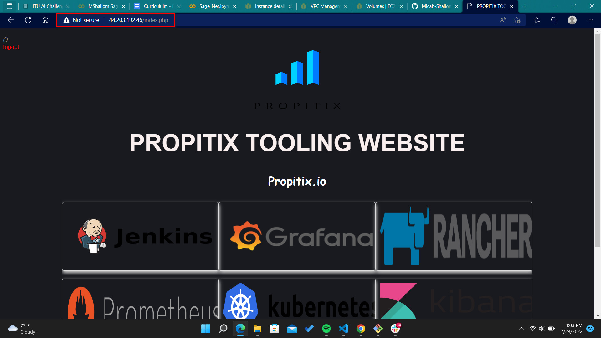

In the `/var/www/html` directory , edit the already written php script to connect to the database `sudo vi /var/www/html/functions.php`


After the modification , connect to the database server from the web server 
`mysql -h <databse-private-ip> -u <db-username> -p <db-pasword> < tooling-db.sql`


Simulate a sign up process by adding user credentials manually to the database
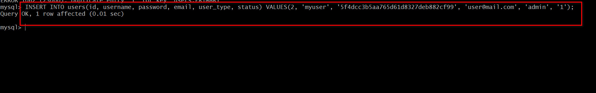

Login by running the following on the browser `<public_ip_address>/login.php`.
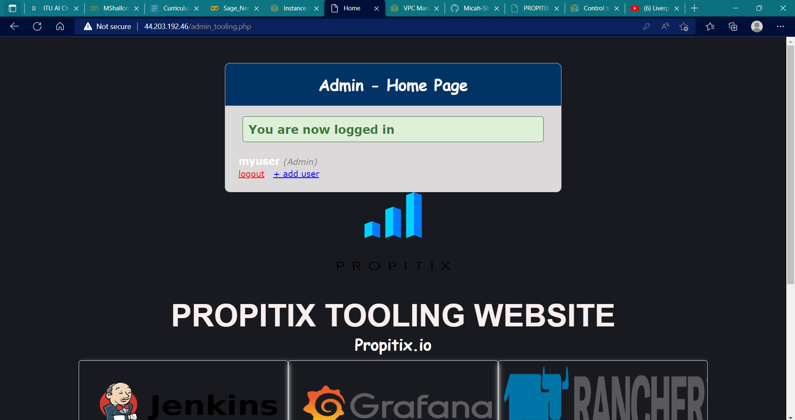
