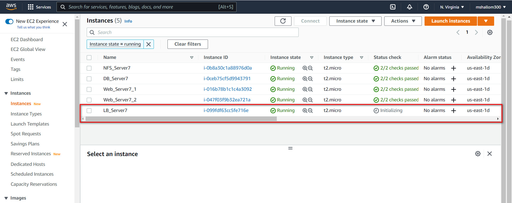
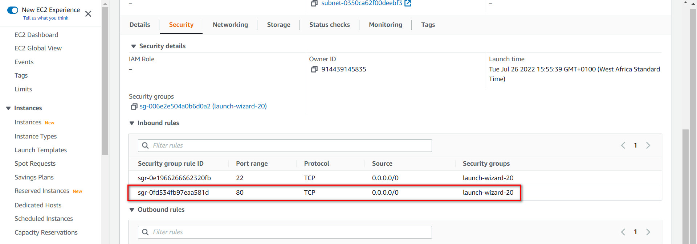
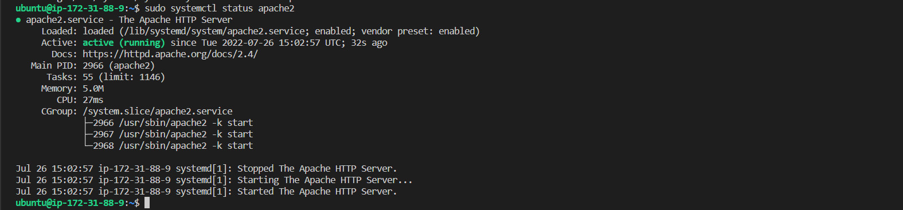
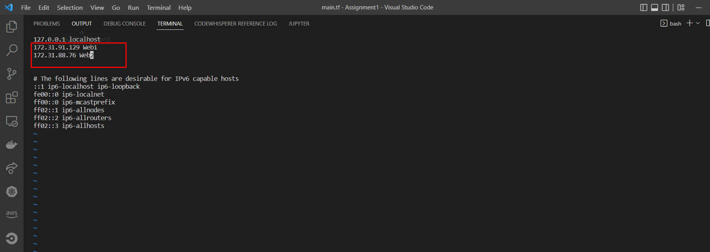
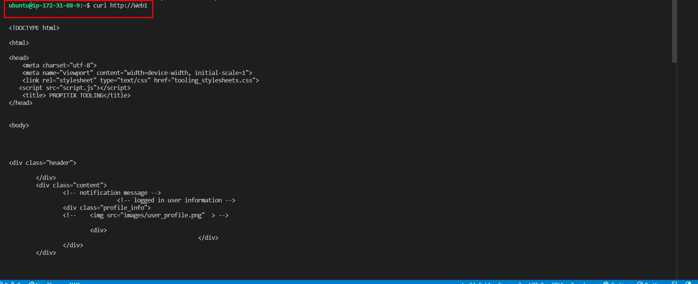
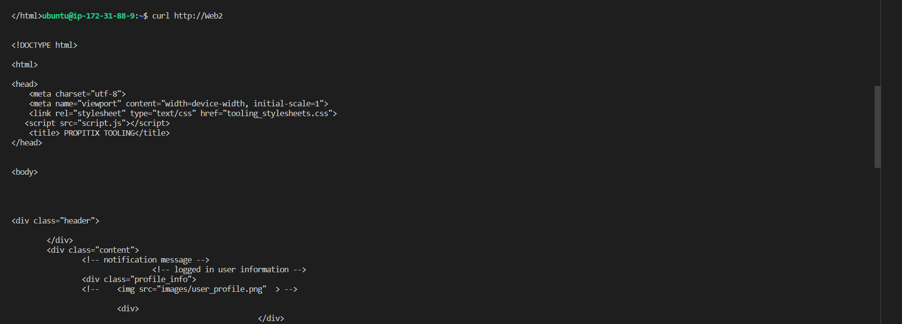

# Load-Balancing-with-Apache

I introduced the concept of file sharing on multiple web servers to access same shared content on an independent external NFS server.

For the website solution implemented, how can we balance users request traffic across the 3 web servers we setup 
([horizontal scaling](https://www.cloudzero.com/blog/horizontal-vs-vertical-scaling#:~:text=Horizontal%20scaling%20(aka%20scaling%20out,server%20may%20be%20your%20solution.))) so as not to put excess load on a single server whilst the others are idle. 

We implement a Load Balancing solution using apache2 so as to handle routing users request to our web servers.


#

# Implementation

Create an ubuntu server which will server as loadbalancer to the webservers


It is important to open up TCP port 80 in the load balancers inbound rule as requests are made through it.



## Installing Packages
Install apache2, libxml and then configure apache for loadbalancing via enabling proxy and proxy_balancer
```
# Installing apache2
sudo apt update
sudo apt install apache2 -y
sudo apt-get install libxml2-dev
```
```
#Enable following modules:
sudo a2enmod rewrite
sudo a2enmod proxy
sudo a2enmod proxy_balancer
sudo a2enmod proxy_http
sudo a2enmod headers
sudo a2enmod lbmethod_bytraffic
```
```
#Restart apache2 service
sudo systemctl restart apache2
sudo systemctl status apache2

```



## Configuring Load Balancer

Edit the `default.conf` file to add the backend web servers into the loadbalancers proxy for routing.
```
sudo vi /etc/apache2/sites-available/000-default.conf

```
```
#Add this configuration into this section <VirtualHost *:80>  </VirtualHost>

<Proxy "balancer://mycluster">
               BalancerMember http://<WebServer1-Private-IP-Address>:80 loadfactor=5 timeout=1
               BalancerMember http://<WebServer2-Private-IP-Address>:80 loadfactor=5 timeout=1
               ProxySet lbmethod=bytraffic
               # ProxySet lbmethod=byrequests
        </Proxy>

        ProxyPreserveHost On
        ProxyPass / balancer://mycluster/
        ProxyPassReverse / balancer://mycluster/
```
**Note:** Only 2 servers were added to the proxy list and also other ways to route traffic aside `bytraffic` includes `byrequests, bybusyness, heartbeats` which can be specified in `ProxySet lbmethod=?` .


Restart the apache2 server `sudo systemctl restart apache2`

On the web browser, test the load balancing connection using the public Ip address of our load balancer server.


To confirm that traffic is routed evenly to both web servers as the load balancer server is receiving traffic (which in our case is by refreshing the webpage) we can check the logs both servers receive `sudo tail -f /var/log/httpd/access_log`

Server1

Server2

#

## Configuring DNS Names (Locally)

In order not to always provide webserver private ip address whenever a new web server needs to be added on the list of loadbalancer proxy, we can specify them on the hosts file and provide a domain name for each which suites us

```
sudo vi /etc/hosts
```



To see this is play we can curl our dns name on the loadbalancer server. Since the DNS names are local DNS configuration we can only access them locally hence the loadbalancer uses them locally to target the backend web servers

Server1_Web1


Server2_Web2

